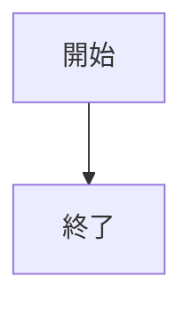

# webpro_06
<<<<<<< HEAD

=======

## このプログラムについて

## ファイル一覧

ファイル名 | 説明
-|-
app5.js | プログラム本体
public/janken.html | じゃんけんの開始画面

# 使用手順
```mermaid
flowchart TD;

start["開始"];
end1["終了"]
if{"条件に合うか"}
win["勝ち"]
loose["負け"]

start --> if
if -->|yes| win
win --> end1
if -->|no| loose
loose --> end1
>>>>>>> def4347c7e0cc19e5f30cf367cdc1953afd13f97
